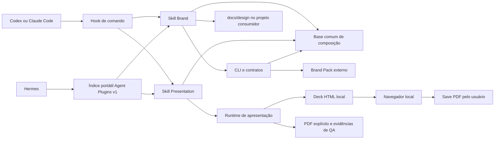

# Arquitetura

## Fronteiras reais observadas

O plugin distribuído permanece identidade-neutro. Brand Packs e conhecimento
mutável pertencem respectivamente ao cliente e ao projeto consumidor.

## Distribuição Hermes na v0.8.0

O Hermes instala o pacote portátil como diretório regular gerenciado em cada
perfil. Instalação e atualização usam o instalador nativo contra a fonte
Smartscaile aprovada, seguidas por Plugin Doctor e uma nova sessão; o diretório
instalado não aponta para o checkout de desenvolvimento.

## Autoridade

- `plugins/brand-runtime/` é a fonte editável do plugin.
- Brand Packs externos são a única autoridade de identidade.
- Projetos consumidores são a autoridade de direção e conhecimento local.
- A instalação em `~/.hermes/plugins/` é artefato gerenciado e nunca é editada
  diretamente.

## Método comum entregue ao consumidor

`design-foundation.md` é a autoridade de método para site, produto, apresentação
e documento. O comando `context` usa `designMethodContext` para entregar a mesma
seção `designMethod` nos modos válidos `brand-pack` e `brand-pending`, sem fundi-la
a `rules`, `brandRules`, tokens ou identidade. Os arquivos são lidos em relação
ao módulo instalado, nunca ao cwd do projeto consumidor, com conteúdo e SHA-256
calculados juntos. Referência ausente bloqueia o comando; não há fallback silencioso.

Brand exige o método antes da composição e na revisão. Presentation referencia
a base e especializa slides, preservando lote progressivo, contratos e export.
Entregar instruções é diferente de executá-las: `instructions-only` não é
aprovação visual nem evidência de uma revisão renderizada.
