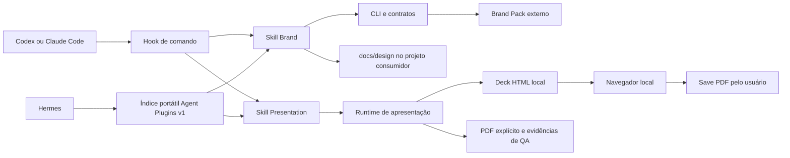
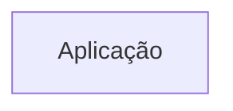
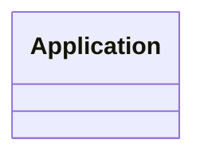

# Arquitetura

## Fronteiras reais observadas

O plugin distribuído permanece identidade-neutro. Brand Packs e conhecimento
mutável pertencem respectivamente ao cliente e ao projeto consumidor.

## Distribuição Hermes na v0.6.0

O Hermes instala o pacote portátil como diretório regular gerenciado em cada
perfil. Instalação e atualização usam o instalador nativo contra a fonte
Smartscaile aprovada, seguidas por Plugin Doctor e uma nova sessão; o diretório
instalado não aponta para o checkout de desenvolvimento.

<!-- specsfy:documentator:start -->
## Componentes

| Tipo | Quantidade |
| --- | --- |
| Código | 1 |
| Testes | 0 |

## Diagramas

<!-- specsfy:documentator:end -->
