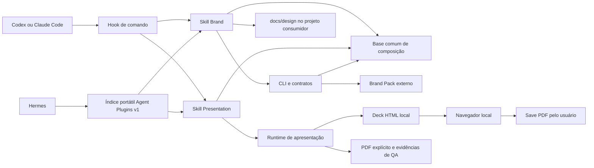

# Arquitetura

## Fronteiras reais observadas

```mermaid
flowchart LR
  CodexClaude[Codex ou Claude Code] --> Hook[Hook de comando]
  Hermes[Hermes] --> Portable[Índice portátil Agent Plugins v1]
  Hook --> Brand[Skill Brand]
  Hook --> Presentation[Skill Presentation]
  Portable --> Brand
  Portable --> Presentation
  Brand --> CLI[CLI e contratos]
  Brand --> Foundation[Base comum de composição]
  Presentation --> Foundation
  CLI --> Foundation
  CLI --> Pack[Brand Pack externo]
  Brand --> Knowledge[docs/design no projeto consumidor]
  Presentation --> Runtime[Runtime de apresentação]
  Runtime --> HTML[Deck HTML local]
  HTML --> Browser[Navegador local]
  Browser --> SavePDF[Save PDF pelo usuário]
  Runtime --> ExplicitPDF[PDF explícito e evidências de QA]
```

O plugin distribuído permanece identidade-neutro. Brand Packs e conhecimento
mutável pertencem respectivamente ao cliente e ao projeto consumidor.

## Distribuição Hermes na v0.10.0

O Hermes instala o pacote portátil como diretório regular gerenciado em cada
perfil. Instalação e atualização usam o instalador nativo contra a fonte
Smartscaile aprovada, seguidas por Plugin Doctor e uma nova sessão; o diretório
instalado não aponta para o checkout de desenvolvimento.

A biblioteca de packs é uma configuração do usuário, independente do perfil.
`brandRoot` mantém compatibilidade com a raiz principal e `additionalBrandRoots`
acrescenta pastas sem copiar packs. A seleção por slug falha quando existem
cópias ambíguas. Cada perfil continua com sua instalação gerenciada do plugin.

Uma seleção explícita em `brandRootsBySlug` resolve apenas o slug autorizado
na biblioteca global. Não altera a precedência de roots explícitas, ambiente
ou entradas locais, nem move ou modifica os diretórios referenciados.

## Autoridade

- `plugins/brand-runtime/` é a fonte editável do plugin.
- Brand Packs externos são a única autoridade de identidade.
- Projetos consumidores são a autoridade de direção e conhecimento local.
- A instalação em `~/.hermes/plugins/` é artefato gerenciado e nunca é editada
  diretamente.

## Método comum entregue ao consumidor

`design-foundation.md` é a autoridade de método para site, produto, apresentação
e documento. O comando `context` usa `designMethodContext` para entregar a mesma
seção `designMethod` nos modos válidos `brand-pack` e `brand-pending`, sem fundi-la
a `rules`, `brandRules`, tokens ou identidade. Os arquivos são lidos em relação
ao módulo instalado, nunca ao cwd do projeto consumidor, com conteúdo e SHA-256
calculados juntos. Referência ausente bloqueia o comando; não há fallback silencioso.

Brand exige o método antes da composição e na revisão. Presentation referencia
a base e especializa slides, preservando lote progressivo, contratos e export.
Entregar instruções é diferente de executá-las: `instructions-only` não é
aprovação visual nem evidência de uma revisão renderizada.

## Engenharia portátil de interface

`designMethod.interfaceEngineering` entrega o guia integral e hash.
`patternCatalog` entrega path, versão, hash e índice filtrado por superfície;
`detailsRequireRead` exige consultar as receitas selecionadas antes de compor.
`interfaceMechanics` entrega path, hash e API do módulo opcional. Todos os
arquivos são resolvidos pelo módulo instalado, inclusive em bundle realocado;
ausência de qualquer dependência declarada bloqueia o contexto. Não há fetch
online, referência a checkout do doador ou dados de cliente nessa operação.

O módulo original sem dependências possui cinco APIs: `compileSequence`,
`sampleSequence`, `cubicBezier`, `createCommitGate` e `mountScene`. Ele não
desenha componentes nem escolhe aparência. O consumidor mantém SSR/fallback,
render/settle, bindings e coordenação dos seus canais externos. Pausa conserva
elapsed por padrão; restart é explícito. Preferência reduzida e print resolvem
static e reiniciam ao voltar. Os contratos de Presentation ficam intactos.
