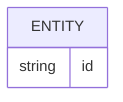

# Banco de dados

## Correção do inventário automático

O projeto não possui banco nem entidade genérica. A persistência observada usa
arquivos de configuração, Brand Packs externos e Markdown estruturado, conforme
`.specsfy/DATABASE.md`. O diagrama automático abaixo é apenas um scaffold da
versão atual do documentador e não representa uma entidade implementada.

<!-- specsfy:documentator:start -->
## Fontes de persistência

| Arquivo |
| --- |
| Nenhuma estrutura confirmada além das fontes listadas. |

<!-- specsfy:documentator:end -->
