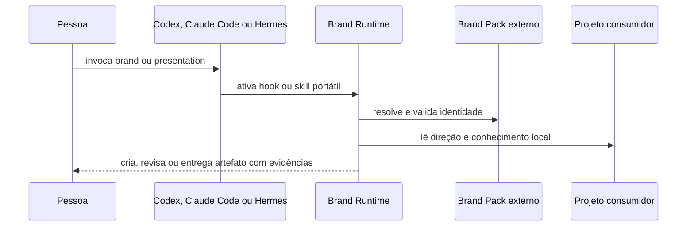
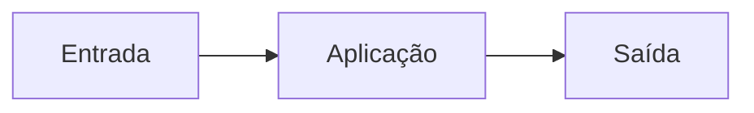
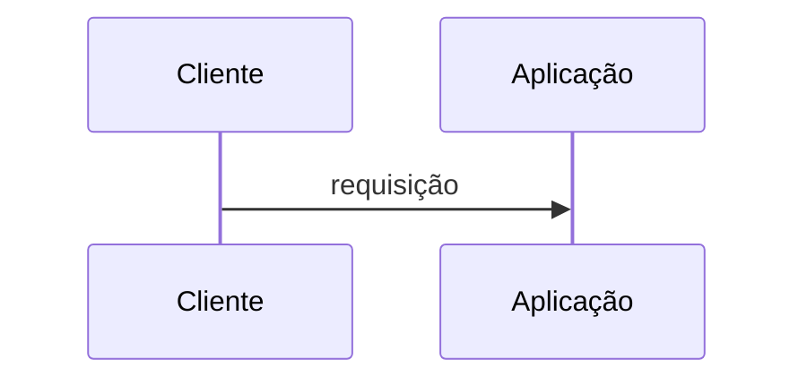

# Fluxos

## Ativação e entrega observadas

```mermaid
sequenceDiagram
  participant Pessoa
  participant Host as Codex, Claude Code ou Hermes
  participant Runtime as Brand Runtime
  participant Pack as Brand Pack externo
  participant Project as Projeto consumidor
  Pessoa->>Host: invoca brand ou presentation
  Host->>Runtime: ativa hook ou skill portátil
  Runtime->>Pack: resolve e valida identidade
  Runtime->>Project: lê direção e conhecimento local
  Runtime-->>Pessoa: cria, revisa ou entrega artefato com evidências
```

<!-- specsfy:documentator:start -->
## Fluxo principal

```mermaid
flowchart LR
  Entrada --> Aplicação --> Saída
```

```mermaid
sequenceDiagram
  participant Cliente
  participant Aplicação
  Cliente->>Aplicação: requisição
```
<!-- specsfy:documentator:end -->
