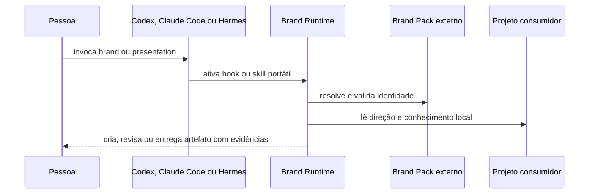
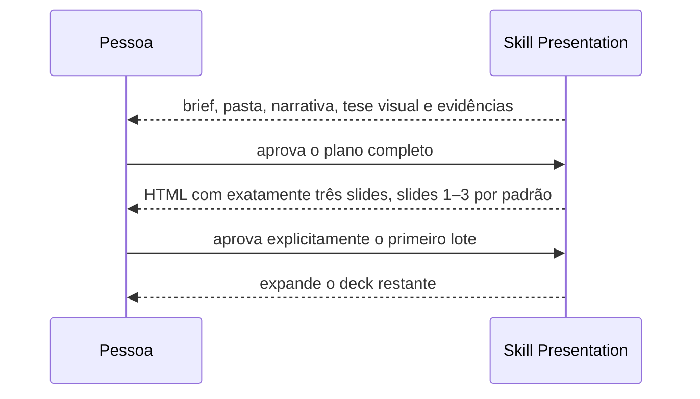

# Fluxos

## Ativação e entrega observadas

## Construção progressiva de apresentações

A aprovação de uma pasta ou de outro checkpoint isolado nunca autoriza a
expansão. Antes da aprovação do primeiro lote, slides futuros não entram no DOM,
no `presentation.spec.json` nem como placeholders.
